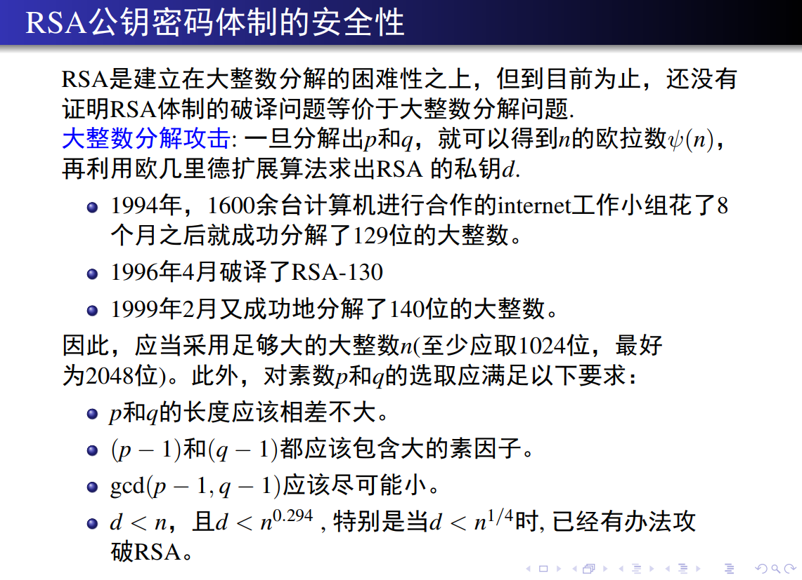

## 第一章 基本概念

### 密码学的发展概况
- 密码学经历了从古典密码学到现代密码学的演变。
- 密码学是研究信息系统安全保密的科学。它包括密码编码学和密码分析学。
- 1949年前密码技术是一门技术性很强的艺术，而不是一门科学。
- 1949年shannon “保密系统的通信理论”，密码学成为科学。
- 1976年Diffie和Hellman“密码学的新方向”，密码学的一场革命。
- 1977年美国国家标准局公布DES，并公开算法，揭开神秘面纱。

### 密码学的重要术语
- 消息又被称为明文，用某种方法伪装消息以隐藏它的内容的过程称为加密，加了密的消息称为密文，而把密文转变为明文的过程为解密。
- 现代密码学引入了密钥，密钥用K表示。
- 加密 EK（M）= C   
- 解密 DK（C）= M
- 对密文解密记为 DK（EK（M））= M
- 有些算法使用不同的加密密钥和解密密钥：
- EK1（M）=C
- DK2（C）=M
- 函数必须具有的特性是，DK2（EK1（M））=M

- **数据的安全基于密钥而不是算法的保密**

### 密码学的发展
- 1976年Diffie & Hellman的“New Directions in Cryptography”提出了不对称密钥密码（公钥密码）
- 1977年Rivest,Shamir & Adleman提出了RSA公钥算法
- 对称算法：加密和解密由同一个密钥来控制，也叫“单钥算法”
- 非对称算法：用作加密的密钥不同于用作解密的密钥，而且解密密钥不能根据加密密钥计算出来，就是非对称算法（AsymmetricAlgorithm）
- 1977年DES正式成为标准
- 80年代出现“过渡性”的“post DES”算法,如IDEA,RCx,CAST等
- 90年代对称密钥密码进一步成熟 Rijndael,RC6, MARS, Twofish, Serpent等出现
- 2001年Rijndael（AES加密算法）成为DES的替代者

- 无密钥传输：公钥密码使得发送端和接收端无密钥传输的保密通信成为可能！！

### 密码学的基本概念
- 明文（plaintext）: 没有加密的信息
- 密文（ciphertext）: 加密后的信息
- 加密变换（encryption）: 从明文到密文的变换
- 解密变换（decryption）: 从密文到明文的变换
- 密钥(key): 加密和解密是在密钥控制下进行的。
- 密码系统模型：
   - 
- 密码体制分类:
   - 对称密码 (单钥密码, 私钥密码):加密密钥与解密密钥相同/如分组密码，流密码
   - 非对称密码体制(双钥密码,公钥密码):加密密钥与解密密钥不同/如公钥密码
   - 
   - 可破译的：如果能够根据密文确定明文或密钥，或根据明文及对应的密文确定密钥
- 密码体制的攻击方法:
   - 穷举攻击：通过试遍所有的密钥来进行破译。
      - 对抗：可增大密钥的数量。
   - 统计分析攻击：通过分析密文和明文的统计规律来破译。
      - 对抗：设法使明文和密文的统计规律不一样。
   - 解密变换攻击：针对加密变换的数学基础，通过数学求解设法找到解密变换。
      - 对抗：选用具有坚实的数学基础和足够复杂的加密算法。
- 密码分析者通常可以在下述情况下进行攻击：
    - 唯密文攻击：密码分析者仅知道一些密文。
    - 已知明文攻击：密码分析者知道一些明文和相应的密文。
    - 选择明文攻击：密码分析者可以选择一些明文，并得到相应的密文。
    - 选择密文攻击：密码分析者可以选择一些密文，并得到相应的明文。
    - 唯密文攻击的强度最弱，攻击强度依此增加。四种攻击方式，强度依次上升。
  
- 无条件安全密码
   - 无条件安全的(不可破译的)：一次一密方案(一次一密乱码本)
   - 计算上安全的：流密码、分组密码、公钥密码

- 密码算法的两条准则
   - 密码算法只要满足以下两条准则之一就行：
       - 1.破译密文的代价超过被加密信息的价值。
       - 2.破译密文所花的时间超过信息的有用期。
   - 满足以上两个准则的密码算法在实际中是可用的。 

### 古典密码体系
   - 置换密码
      - 在置换密码体制中，明文中的字或字母被重新排列，字或字母本身不变，但位置发生了改变，形成密文，又称为易位密码。
      - 最简单的易位密码是采用报文倒置法，即将报文按字的顺序依次倒置，并截成固定长度的字母组，形成密文.
      - 特点： 简单，缺点是不安全，很容易被识破。
   - 单表代替密码
      - 代替密码是把明文中的每一个字符替换成密文字母表中的另一个字符，并使用密钥K与之进行运算，得到密文；接收者对密文进行逆运算就可以恢复出明文
      - 单表代换密码又可以分为：
         - 加法密码
            $$
             f (ai) = bi = aj 
             j = i+k(mod n) , (ai∈A ,0<k<n)
            $$
            - Caesar密码就是一种加法密码
         - 乘法密码
            $$
             f (ai) = bi = aj 
             j = ik(mod n) , (ai∈A ,0<k<n，(k,n)=1)
            $$
         - 仿射密码
            $$
             f (ai) = bi = aj
             j = k0 +ik1 (mod n) , (ai∈A ,0<k0 <n，(k1 ,n)=1)
            $$
         - 密钥短语代替密码
            $$
             f (ai) = bi = aj 
             j = ik(mod n) , (ai∈A ,0<k<n，(k,n)=1)
            $$
           - 这种密码选用一个英文短语或者单词串作为密钥，称为密钥字或密钥短语，
           - 例如 HAPPY NEW YEAR，去掉其中的重复字母，得到一个无重复字母的字母串，即HAPYNEWR，把它依次写在明文字母表之下，而后再将字母表中未在字母串中出现过的字母依次写于此短语之后，就可以构造一个字母替换表 
           - 
   - 多表代换密码
      - 
      - 
      - 
      - 
      - 
      - 
    - 

## 第三章 分组密码

### 分组密码的概念

### 分组密码构造的原则
- 有足够大的分组长度(保证足够大的明文空间)
- 密钥空间要尽可能大(防止穷举)
- 保证足够强的密码算法复杂度以加强分组密码算法自身安全性
   - 先将一个明文分组划分为若干个子组分别进行处理,然和合并并变换
   - 采用乘积密码的思想,通过两种或两种以上简单密码的逐次应用,构造强度比其中任意一个更强的加密结果
- 尽量使用简单运算(加法乘法异或移位)来实现,易于处理器运算
- 加解密硬件结构最好一致,简化系统整体结构的复杂性

### 增强密码算法复杂度的方法:SP结构
- S变换:把输入的n长的比特串,并将其转换为特定数量的m长的输出比特串,其中n不一定等于m (起到混乱的效果)
   - 混乱:复杂化明文\密钥\密文之间的统计关系,采用复杂的非线性代替变化效果更好
- P变换:通过把一个比特串中各比特的位置次序重新排列而得到新的比特串(起到扩散的效果)
   - 扩散:使明文中的每一位直接或间接影响输出密文中的许多位。

### DES算法特性
> Walter Tuchman⁄Carl Meyer3
> 使用同一个算法加密解密，加密解密密钥的倒用、64bit明文分组、54bit密钥、存在弱密钥
- 采用了Feistel密码的S-P结构
- **加密和解密使用同一算法、同一密钥、同一结构**
- 加密算法具有可逆性，解密和加密类似，可共用一个算法，所不同的是子密钥顺序使用相反，依次为k16，...，k1.

- DES算法的密钥拓展算法有缺陷，存在弱密钥和半弱密钥：

### 三重DES算法

### IDEA算法特性
> 来学嘉/James Massey 初版叫做PES->IPES->IDEA
> 64bit明文分组，不存在弱密钥（只有伪弱密钥）

- 加密变换和解密变换是互逆的,只是解密过程使用的子密钥是对加密过程的相应子密钥求逆得到的。

### AES算法特性（Rijndael算法）
> VincentRijmen⁄Joan Daemen
> 2个比利时学者发明，四个步骤——字节替换、行移位、列混合和轮密钥加，不存在弱密钥
- 符合的三个设计准则：可抗所有已知攻击、适应多个平台快速运算和紧凑编码、设计简单

- 解密算法是加密算法的逆变换：字节替换-》逆字节替换、行移位-》逆行移位、列混合-》逆列混合、轮密钥加的逆变换

### 四种工作模式
> ECB（电子密码本模式）、CBC（密码分组链接模式）、OFB（密码反馈模式）、CFB（输出反馈模式）

- 四种工作模式的优缺点

- ECB
   - 优点：支持并行加密
   - 缺点：相同明文对应相同密文，会暴露明文的统计特性
- CBC
   - 优点：相同明文对应不同密文，不会暴露明文的统计特性，支持并行解密
   - 缺点：不支持并行加密
- OFB
   - 优点：相同明文对应不同密文，不会暴露明文的统计特性，支持并行解密
   - 缺点：不支持并行加密
- CFB
   - 优点：相同明文对应不同密文，不会暴露明文的统计特性，支持并行加解密
  
### 可能的出题形式
> 出一个加密结构图，要求写出对应的解密结构图 | 分析各种算法、操作的优缺点

## 第四章 公钥密码

### 公钥加密以及对称密码的优缺点分析
- 公钥密码体制
   - 优点：可以适用网络的开放性要求，密码管理更加简单，更方便实现数字签名和认证
   - 缺点：公开密钥的算法相对复杂，加/解密速度较低
   - 实际应用：加解密使用对称密码体制，密钥管理使用公钥密码体制

### 公钥密码的基本原理（单向函数与陷门单向函数）

### 欧拉定理、欧拉函数（费马小定理的推广）

### 群的概念——非空集合定义一个代数运算满足封闭性、结合律、单位元、逆元的条件

### RSA算法全解析
> Rivest,Shamir,Adleman 1978
> 理论基础为数论中的大整数因子分解的困难性

### ELGamal算法以及ELGamal算法的变形全解析
> ELGamal 1985
> 基于离散对数问题的公钥密码体制

### 可能的出题形式
> 说出一个加密算法，要求写出对应的解密算法

### 安全模型的刻画——IND-CPA、IND-CCA1、IND-CCA2：

**IND-CPA:**

**IND-CCA:**

- RSA算法不满足IND-CPA的安全模型，请写出其攻击方法
- ELGamal不满足IND-CCA的安全模型，请写出其攻击方法

### 掌握Crammer-Shoup方案

### 可能的出题形式
> 给参数和加密的算法，写出对应的解密算法

## 第五章 数字签名

### RSA签名算法

### ELGamal签名算法

### Schnorr等所有签名算法

### 可能的出题形式
> 给加密算法，写出签名验证算法

### 可能的出题形式
> 给予整个算法，证明其正确性（为什么能够用这种方法验证）

### 签名的安全模型：多阶段、定义优势、加解密安全模型

### EDL不要求掌握

## 综合考点

### 流行的难题：

- 基于大整数的因子分解问题，最典型的代表是RSA体制
- 基于离散对数的问题，如ELGamal公钥密码体制和椭圆曲线公钥密码体制

### 多表代替密码算法（PPT上的例题）

### 可能的出题形式：给予矩阵参数+明文，要求计算密文。

## 考试题型

- 选择题
- 填空题
- 判断题
- 简答题（可能会设计分组密码设计的原则）
- 综合解答题