# Logistic回归

> 预测的变量 y 是一个离散的值情况下的分类问题。

## 分类
现在有这样一个分类任务，需要根据肿瘤大小来判断肿瘤的良性与否。训练集如上图所示，横轴代表肿瘤大小，纵轴表示肿瘤的良性与否，注意，纵轴只有两个取值，1（代表恶性肿瘤）和0（代表良性肿瘤）。通过之前的博文，我们已经知道对于以上数据集使用线性回归来处理，实际上就是用一条直线去拟合这些数据。因此，你得到的 Hypothesis 可能如下： 
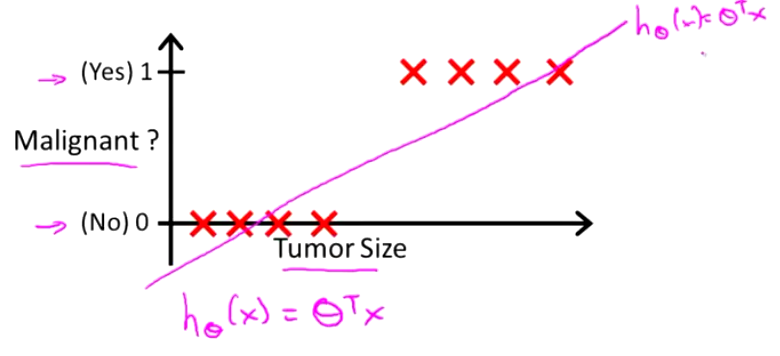
- 此时如果你想做出预测，一种可行的方式是如下： 
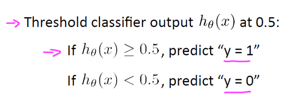
- 现在，我们对以上问题稍作一些改动。将横轴向右扩展，并且增加一个训练样本，如下： 
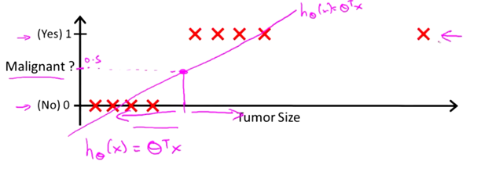 
此时，我们使用线性回归，会得到一条新的直线： 
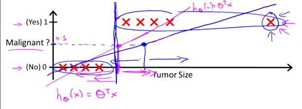
- **此时，我们再用0.5作为阈值来预测肿瘤的良性与否，就不合适了。**

## 假设陈述
- 当有个一个分类问题的时候，我们要使用哪个方程？ 
- 定义函数g如下：g(z) = 1/1+e^(-z)   　　　(sigmoid函数或称为logistic函数) 
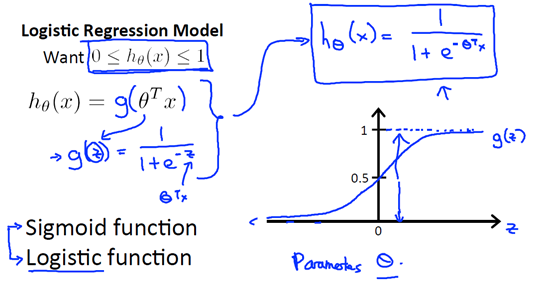
- 对于假设函数的输出值意义的解释：假如将一个病人肿瘤大小输出得到0.7，则可以认为该病人有70%几率患有恶性肿瘤。 
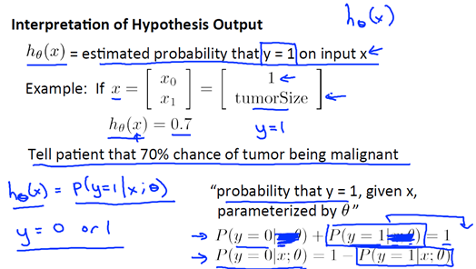

## 决策界限
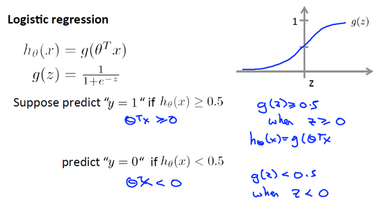
- 即预测y=0只需要θ^Tx>=0
- 有如下一个例子： 
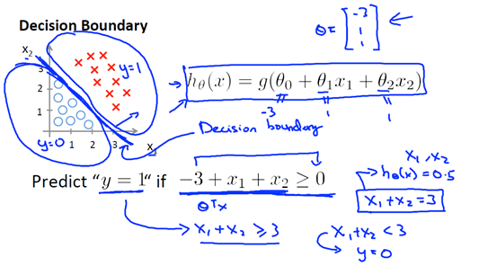 
我们可以画出一个界限X1+X2=3，即为决策边界。
- 又有如下一个例子： 
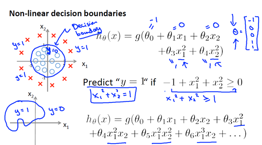 
我们可以画出一个界限X1^2+X2^2=1，即为决策边界。

## 代价函数
- 我们需要定义**优化目标**或者**代价函数**来拟合参数θ，这便是监督学习问题中的逻辑回归模型的拟合问题。 
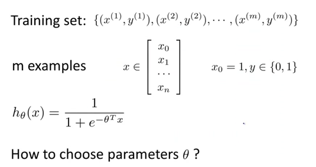
- 需要解决的问题：我们有一个训练集，里面有m个训练样本，同之前一样，我们的每个样本使用n+1维的特征向量表示（x0 = 1）。并且由于是分类问题，我们训练集中的所有y，取值不是0就是1。假设函数的参数即为θ。那么，对于这个给定的训练集，我们如何拟合参数θ（或者说是选择参数θ）？
- 之前，我们使用线性回归模型来拟合假说参数θ时，使用了如下的代价函数，我们稍作改变，将原先的1/2m中的原先的1/2放到了求和符号里面。
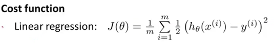
- 现在我们使用另一种方式，来书写代价函数： 
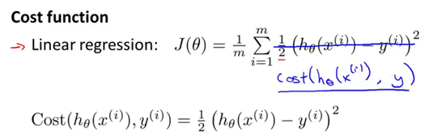
- 在线性回归中，代价项（Cost函数）会被定义为：1/2乘以预测值h和实际值观测的结果y的差的平方。这个代价值可以很好地用在线性回归里，但是对于逻辑回归却是不合适的。
- 如果我们可以最小化代价函数J(θ)中的代价项（Cost函数），那么我们的确可以使用该代价项。但实际上，如果我们使用该代价项，那么代价函数J(θ)会变成关于参数θ的非凸函数。因为**对于逻辑回归来说，这里的h函数是非线性的**，是一个很复杂的非线性函数，因此如果用h函数来构造我们在线性回归中所使用的代价项（Cost函数），接着再用该代价项来构造代价函数J(θ)。那么J(θ)可能有很多局部最优值： 
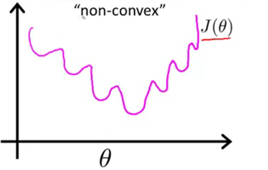
- 实际上，这就是一个非凸函数。不难发现，如果你把梯度下降法用在一个这样的函数上的话，我们并不能保证它会收敛到**全局最小值**。
- 显然，我们希望我们的代价函数J(θ)是一个凸函数，也就是一个单弓形函数。因此我们对Cost函数进行修改： 
- y=1与y=0的两种情况： 
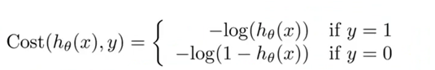
- 如果预测值趋于0，而实际y=1，那么代价便趋于无穷以惩罚算法。 
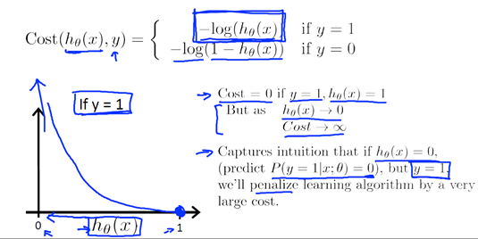
- 如果预测值趋于1，而实际y=0，那么代价便趋于无穷以惩罚算法。 
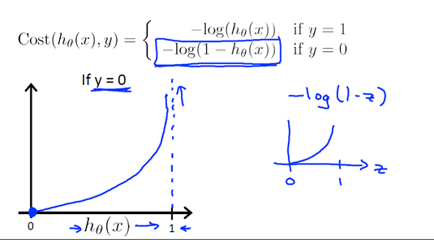
- 简化代价函数的方法：
  $$
  Cost(hθ(x),y) = -ylog(hθ(x))-(1-y)log(1-hθ(x))
  $$
  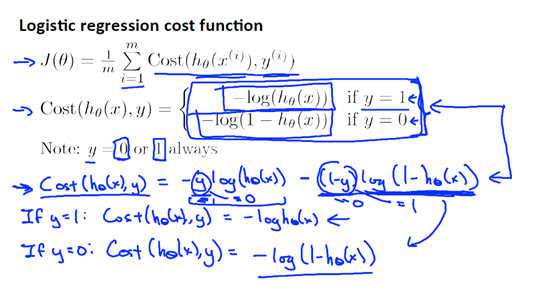
- 写为如下形式： 
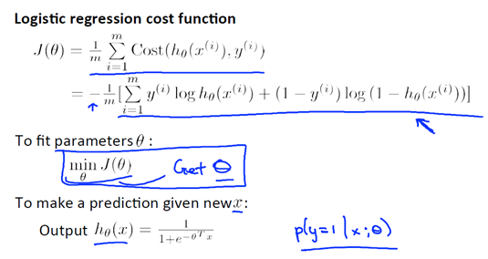
- 最小化代价函数： 
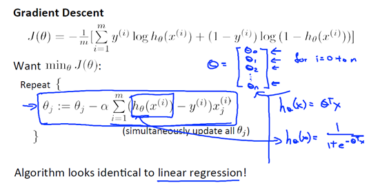

## 高级优化
- 有更多更高级更复杂的优化算法（BFGS、L-BFGS）

## 多元分类：一对多
- 多类别分类问题：如天气有晴天(y=0)，雨天(y=1)，阴天(y=2)，下雪天(y=3)
- 一次选择一个类别，将其他设置为负类别,得到多个分类器。 
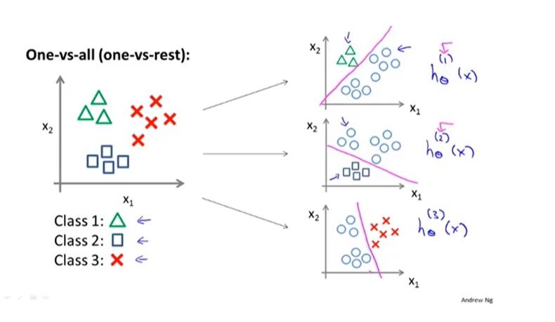
- 在多个分类器输入x，最后选择h最大的类别。