# 多变量线性回归

> 适用于多个变量或者特征量，Multiple features（多维特征）。

## > 多功能
- 常用的表达：
    - n表示特征的数量
    - x^(i)表示第i个训实例，是特征矩阵的第i行，是一个向量。
    - xj^(i)代表特征矩阵中第i行的第j个特征，也就是第i个训练实例的第j个特征。
    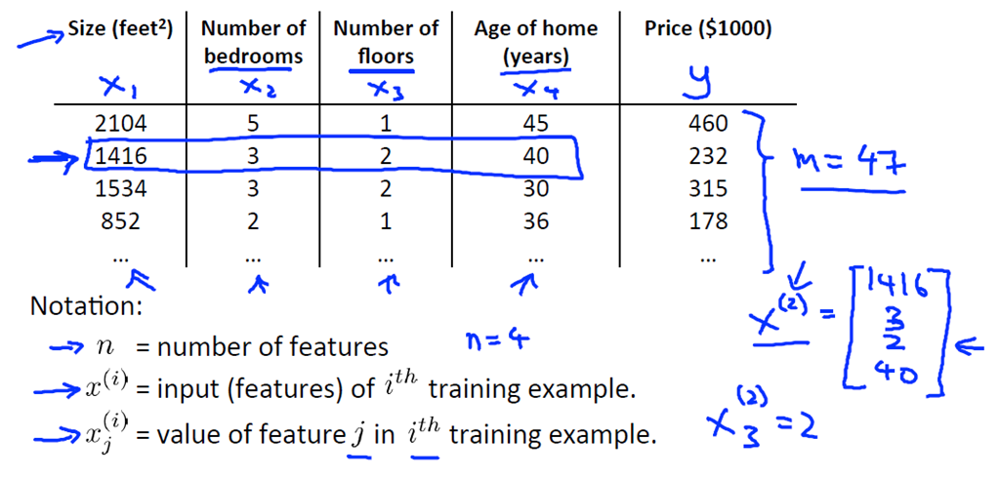
    - 因此我们需要对假设函数进行修改，将所有特征量相加：
    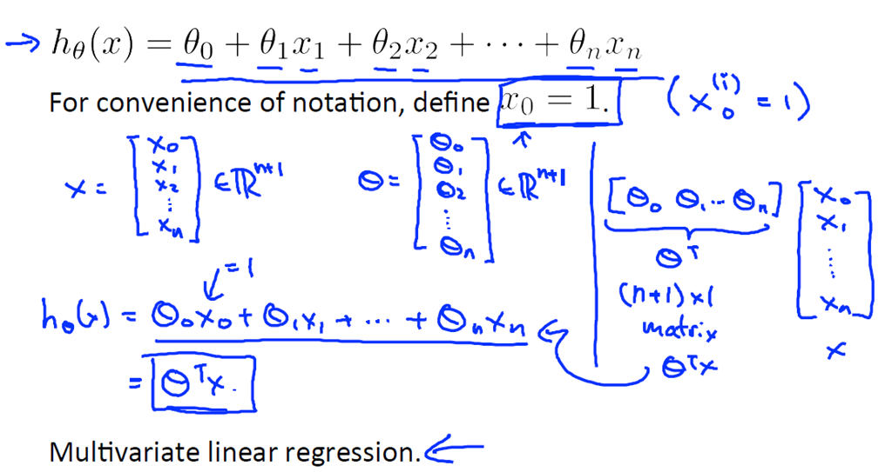
    - 若将所有参数写成向量，对于x需要从x0=1开始写。
    - 最终公式转化为： 
    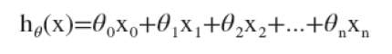
    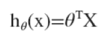

## > 多元梯度下降法

### 多变量梯度下降（Gradient descent for multiple variables）:
- 不断更新每个θj的参数，通过θj减去α乘以导数项。
 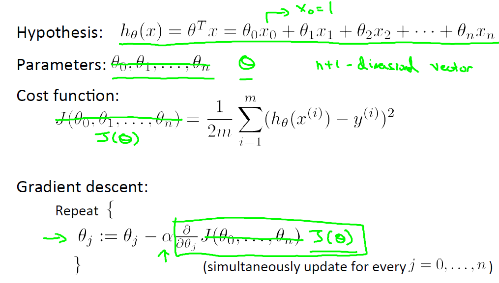
- 新的算法，更新规则应用于多元线性回归：
 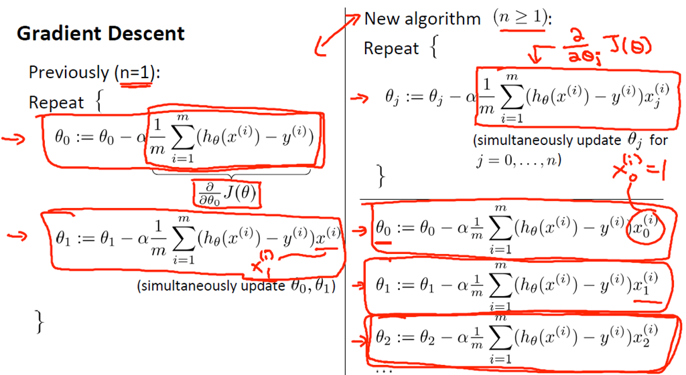

### 特征缩放 (feature scaling)
- 如果有一个有多个特征的机器学习问题。若能确保这些特征都处在一个相近的范围（确保不同特征的取值在相近的范围内），这样梯度下降法就能更快地收敛。具体来说，假如你有一个具有两个特征的问题，其中x1 是房屋面积大小，它的取值在0到2000之间，x2 是卧室的数量，这个值取值范围在1到5之间。如果画出代价函数J(θ) 的轮廓图：
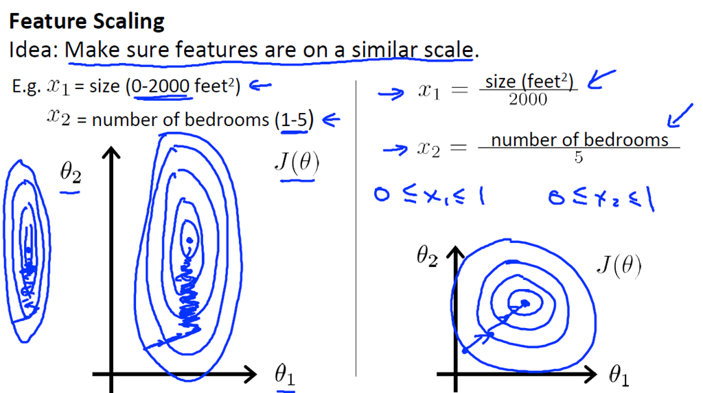
- 那么这个轮廓看起来，应该是如上图左边的样子。J(θ) 是一个关于参数 θ0 、θ1 和 θ2 的函数，我在此处忽略 θ0 （暂时不考虑 θ0）。并假想一个函数的参数，只有 θ1 和 θ2，但如果变量 x1 的取值范围远远大于 x2 的取范围的话，那么最终画出来的代价函数 J(θ) 的轮廓图就会呈现出这样一种非常偏斜并且椭圆的形状。2000和5的比例会让这个椭圆更加瘦长。所以，这是一个又瘦又高的椭圆形轮廓图，正是这些非常高大细长的椭圆形构成了代价函数 (θ)，如果你用这个代价函数来进行梯度下降的话，你要得到梯度值最终可能需要花很长一段时间才能得到。并且可能会来回波动，然后会经过很长时间，最终才收敛到全局最小值。事实上，你可以想像如果这些轮廓再被放大一些的话如上图最左边的那样（如果你画的再夸张一些，把它画的更细更长），那么可能情况会更糟糕。**梯度下降的过程可能更加缓慢，需要花更长的时间，反复来回振荡，最终才找到一条正确通往全局最小值的路**。
- 在这样的情况下一种有效的方法是进行特征缩放(feature scaling)。(如右图)举例来说，**把特征 x 定义为房子的面积大小除以2000，并且把 x2 定义为卧室的数量除以5**。如此一来，通过特征缩放，通过“消耗掉”这些值的范围（在这个例子中，我们最终得到的两个特征 x1 和 x2 都在 0 和 1 之间），你得到的梯度下降算法就会更快地收敛。表示代价函数 J(θ)的轮廓图的形状偏就会没那么严重，也许看起来会更圆一些。
- 如果你用这样的代价函数，来进行梯度下降的话，那么梯度下降算法就会找到一条更快捷的路径通向全局最小，而不是像刚才那样，沿着一条让人摸不着头脑的路径、一条复杂得多的轨迹来找到全局最小值。
- 更一般地，我们执行特征缩放，将特征的取值约束到-1 到 +1 的范围内（注意：特征 x0 是总是等于1，已经在这个范围内）。但对其他的特征，我们可能需要通过除以不同的数来让它们处于同一范围内。-1 和 +1 这两个数字并不是太重要（但不能过大或者过小）。

### 均值归一化(mean normalization)
- 有一个特征 xi，用 xi - μi 来替换它，通过这样做，让特征值具有为0的平均值（μi 指所有 xi 的平均值）。
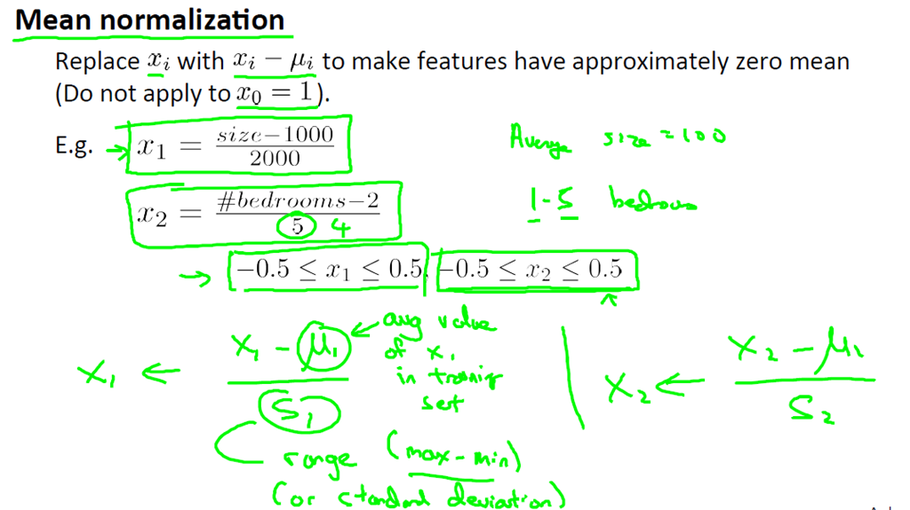
- 在这两种情况下你可以算出新的特征 x1 和 x2，这样它们的范围，可以在 -0.5 和 +0.5 之间(x2 的值实际上有可能会大于0.5但很接近)。
- 更一般的规律是，你可以用如下的公式来替换原来的特征 x1：
 $$
 (x1 - μ1)/S1
 $$
其中定义μ1为训练集中特征x1的平均值，s1则是该特征值的范围（标准差）。

### 学习率α（Learning rate）：
- 如何调试（也就是如何确定梯度下降是正常工作的）以及如何选择学习率 α。
- 梯度下降算法所做的事情就是为你找到一个 θ 值，并希望它能够最小化代价函数 J(θ)。我们通常可以在梯度下降算法运行时绘制出代价函数 J(θ) 的值。（注意这里的 x 轴是表示梯度下降算法的迭代步数）
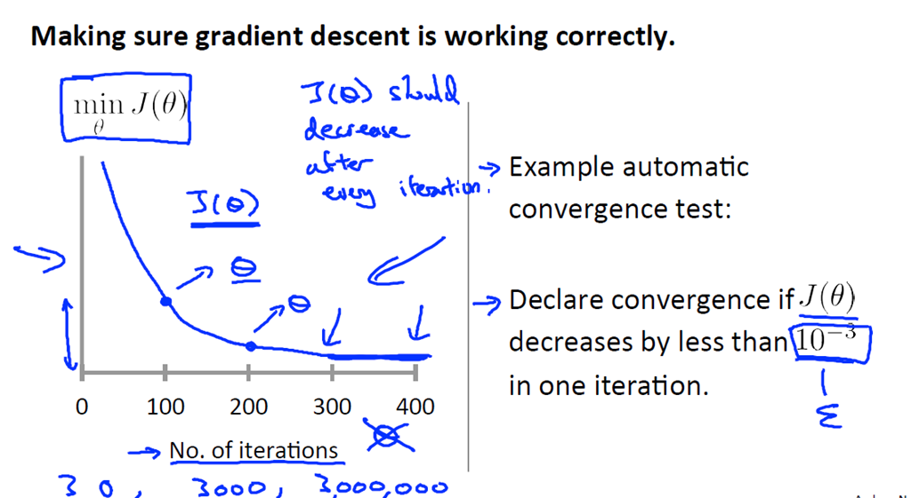
- 曲线上一点的含义是这样的：假如当我运行完100步的梯度下降迭代之后，无论我得到什么 θ 值（无论如何，100步迭代之后，我将得到一个 θ 值），根据100步迭代之后得到的这个 θ 值，我们可以计算出代价函数 J(θ) 的值，而这个点的垂直高度就代表梯度下降算法经过100步迭代之后而算出的 J(θ) 值。
- 如果梯度下降算法正常工作，那么每一步迭代之后J(θ) 都应该下降。这条曲线用处在于，它可以告知你一些信息：例如，在这里400步迭代的时候，梯度下降算法基本上已经收敛了，因为代价函数并没有继续下降，观察这条曲线可以帮助你判断梯度下降算法是否已经收敛。
- 也许对于某一个问题，梯度下降算法只需要30步迭代就可以收敛；然而换一个问题，也许梯度下降算法就需要3000步迭代；再对于另一个机器学习问题而言，则可能需要三百万步迭代。实际上，我们很难提前判断梯度下降算法需要多少步迭代才能收敛。因此，通常我们需要画出这类曲线，画出代价函数随迭代步数增加的变化曲线。我们可以通过看这种曲线，来试着判断梯度下降算法是否已经收敛。
- **此外，也可以进行一些自动的收敛测试**，也就是说用一种算法，来告诉你梯度下降算法是否已经收敛。自动收敛测试一个非常典型的例子是：如果代价函数 J(θ) 的下降小于一个很小的值 ε ，那么就认为已经收敛（比如可以选择1e-3），但是通常要选择一个合适的阈值 ε 是相当困难的。因此为了检查梯度下降算法是否收敛，我们实际上还是通过观察之前介绍的代价函数随迭代步数增加的变化曲线，而不是依靠自动收敛测试。
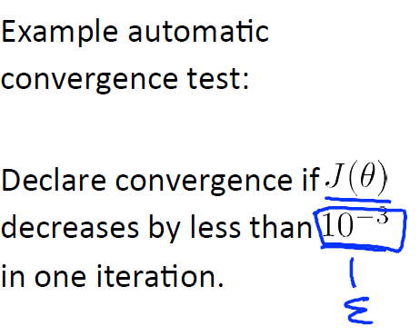
- 此外，这种曲线图也可以在算法没有正常工作时，提前警告你。
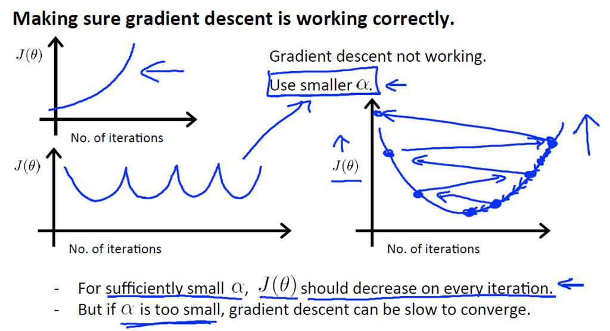
具体地说，如果代价函数 J(θ) 随迭代步数的变化曲线是上图左上角的这个样子，J(θ) 实际上在不断上升，那么这就很明确的表示梯度下降算法没有正常工作。而这样的曲线图，通常意味着你应该使用较小的学习率 α。同样的 有时你可能看到上图左下角这种形状的 J(θ) 曲线，它先下降，然后上升，接着又下降，然后又上升，如此往复。而解决这种情况的方法，通常同样是选择较小 α 值。
- 总结一下：**如果学习率 α 太小，你会遇到收敛速度慢的问题，而如果学习率 α 太大，代价函数 J(θ) 可能不会在每次迭代都下降，甚至可能不收敛，在某些情况下，如果学习率 α 过大，也可能出现收敛缓慢的问题。但更常见的情况是，你会发现代价函数 J(θ)，并不会在每次迭代之后都下降。**为了调试所有这些情况，绘制J(θ)随迭代步数变化的曲线，通常可以帮助你弄清楚到底发生了什么。
- 我们运行梯度下降算法时，通常会尝试一系列α值，如：…,0.001, 0.003, 0.01, 0.03, 0.1, 0.3, 1,…对于这些不同的 α 值，绘制 J(θ)随迭代步数变化的曲线，然后选择看上去使得 J(θ)快速下降的一个 α 值。

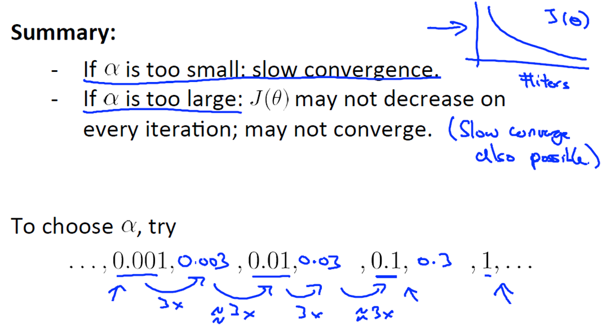

## > 特征和多项式回归
选择特征的方法以及如何得到不同的学习算法。当选择了合适的特征后，这些算法往往是非常有效的。多项式回归，使得能够使用线性回归的方法来拟合非常复杂的函数，甚至是非线性函数。
$$
例子：hθ(X) = θ0 +θ1 × X1+ θ2 × X2 + θ3 × X3
$$

- 第一个特征 x1 设为房子的面积，将第二个特征 x2 设为房屋面积的平方，将第三个特征 x3 设为房子面积的立方。也可以理解为通过设置3个特征，从而将模型转化为线性回归模型。(注：如果我们采用多项式回归模型，在运行梯度下降算法前，进行特征缩放非常有必要。)
- 需要说明的是，如果你像这样选择特征，那么特征的归一化就变得更重要了，因为这三个特征的范围有很大的不同。因此，如果使用梯度下降法，使用特征值的归一化是非常重要的，这样才能将他们的值的范围变得具有可比性。
- 再来看一个例子，关于如何使你真正选择出要使用的特征。此前我们谈到一个像这样的二次模型并不是理想的，因为你知道也许一个二次模型能很好地拟合这个数据，但二次函数最后会下降，这是我们不希望看到的。但是，除了转而建立一个三次模型以外，你也许有其他的选择特征的方法，如下：
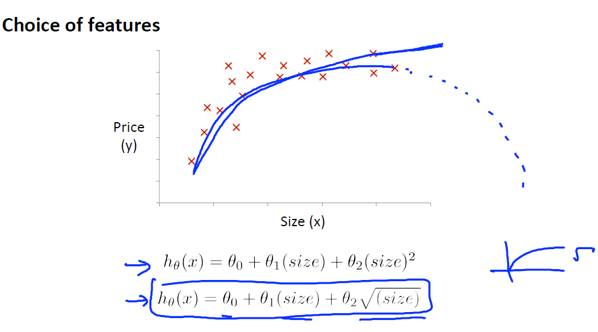
- 注意在使用特征时的选择性。例如，我们不使用房屋的临街宽度和纵深，而是把它们乘在一起，从而得到房子的土地面积这个特征。

## > 正规方程
- 对于某些线性回归问题，正规方程式是更好的解决方案。
- 正规方程通过求解以下方程： 
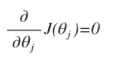 
来求出使得代价函数最小的参数。 
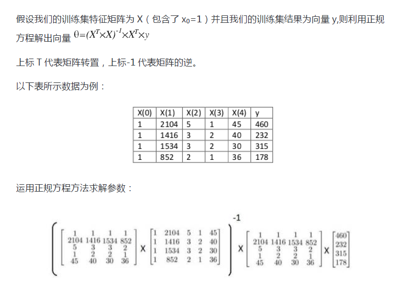
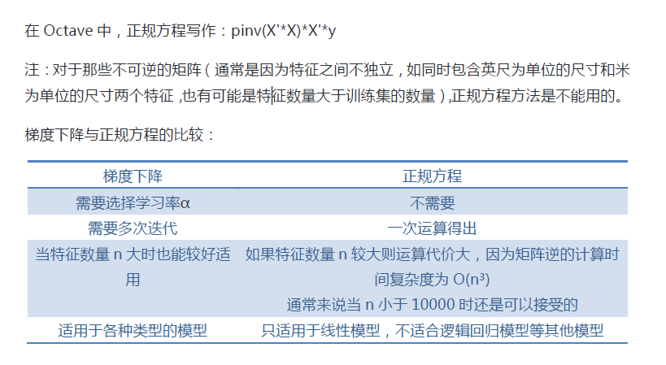
- 通过删除多余特征或影响较小的特征或使用正则化方法，解决矩阵X^T*X不可逆的情况。