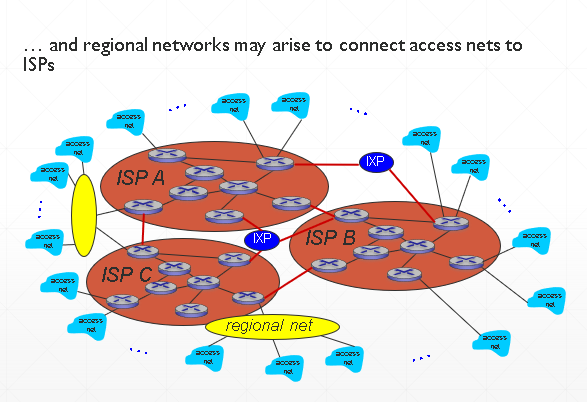
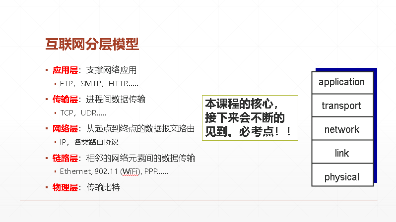
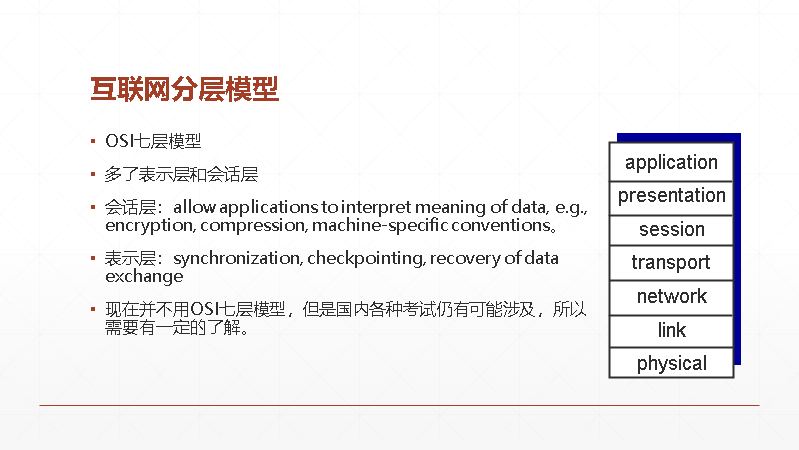

# 概述

> 第一章

## > 什么是互联网？

- 将各种网络（无数的异构网络）连接在一起。
- 互联网标准： 
RFC （Request for comments）所有互联网标准都以RFC的形式发表（建议标准、互联网标准） 
IETF（Internet Engineering Task Force）负责互联网的标准化工作
- 数以亿计的计算设备连接在一起：
   - 主机hosts （终端系统）
   - 运行网络程序（network apps）
- 通信链路：
   -  光纤、铜导线、卫星通信、射频通信
   -  传输速率称之为带宽（bandwidth）
- 分组交换：
   - 转发分组数据包
   - 路由和交换机

## > 什么是协议？

- **协议定义了消息格式、发送和接受消息的顺序、以及发出或收到指定消息之后所采取的行为。**
- 所有互联网上的信息通信都由各种不同的协议进行管理和控制。

## > 互联网的组成

- 边缘部分：主机 hosts – 客户端和服务器（服务器往往部署在数据中心）
- 接入网、物理链路：有线或无线的通信链路
- 核心部分：互联的路由器、连接异构的、不同的网络

### 边缘部分

- 主机通信方式 – C/S方式：客户 (client) 和服务器 (server) 都是指通信中所涉及的两个应用进程。
- 主机通信方式 – P2P方式：对等连接 (peer-to-peer，简写为 P2P) 是指两个主机在通信时并不区分哪一个是服务请求方还是服务提供方。

### 核心部分

- 互联网的核心部分由互联的**路由器/交换机**组成（interconnected routers），核心部分要向网络边缘中的大量主机提供连通性，使边缘部分中的任何一个主机都能够向其他主机通信（即传送或接收各种形式的数据）。
- 路由器是实现分组交换 (packet switching) 的关键构件，其任务是转发收到的分组，这是网络核心部分最重要的功能。
- 主要的通信方式：电路交换（circuit switching）和分组交换（packet switching，用于互联网中）
   - 电路交换：资源专用，无共享，保证了性能和体验，传统电话网络中采用。
   - 电路交换不适合计算机网络：计算机数据具有突发性（“双11”？）因此，若设计通信链路时按照峰值的数据量设计，则在平时通信链路的利用率很低。
   - 分组交换：主机将较长的报文划分成固定长度的、较短的数据段，在每一段前面加上首部（header），构成所谓的分组（packet）再依次将分组发送到接收端，并重新组合。
   - 分组交换的接收端：剥去header，重新组成原报文，Header的作用是不同的协议进行识别和控制。
   - 每个分组在互联网中独立地选择传输路径，路径可能不同！ 存储转发（store-and-forward）：只有整个分组到达了一个路由器，它才能被转发到下一段链路。
   - 带宽为R bps的链路，传输大小为L bits的分组，需要L/R秒。采用存储转发的模式，意味着需要完全传输完一个分组才能继续发送到下个链路。因此，图中的端到端的延时是2L/R。举例，若L=7.5 Mbits，R=1.5 Mbps。则端到端的延时是10秒，单独一跳的延时则是5秒。
   - 不像电路交换，分组交换并没有“专用”链路，因此可能发生拥塞！对于一条链路，如果到达速率（arrival rate, bits）超过了链路的带宽（传输速率），并保持一定时间，则会发生拥塞：分组将在路由的缓存中进行排队，等待发送进入链路如果路由的缓存已满，则分组可能会被丢弃，信息可能会丢失。
   - 分组交换优缺点分析：
      - 分组交换的缺点：排队、延时、首部的开销、丢包。
      - 分组交换的优点：高效、灵活、迅速、可靠。
- 路由与转发：
   - 路由：基于路由算法决定从源地址到目的地址的整个路径。
   - 转发：在一个路由器中，从某个输入端口获得分组，如何移动了合适的输出端口。
- 互联网的结构：端系统/主机，通过连接access ISP（Internet Service Providers）接入互联网。 

## > 性能/非性能评价指标

1. 速率：速率是计算机网络中最重要的一个性能指标，指的是数据的传送速率,它也称为数据率 (data rate) 或比特率 (bit rate)。速率的单位是 bit/s，或 kbit/s、Mbit/s、 Gbit/s等。**速率往往是指额定速率或标称速率，非实际运行速率。  **
2. 带宽：在计算机网络中，带宽用来表示网络中某通道传送数据的能力。表示在单位时间内网络中的某信道所能通过的“最高数据率”。单位是 bit/s，即 “比特每秒”。    
3. 吞吐量：吞吐量 (throughput) 表示在单位时间内通过某个网络（或信道、接口）的数据量。（吞吐量受网络的带宽或网络的额定速率的限制。）
4. 时延：时延 (delay 或 latency) 是指数据（一个报文或分组，甚至比特）从网络（或链路）的一端传送到另一端所需的时间。（包括发送时延、传播时延、处理时延、排队时延）【对于高速网络链路，我们提高的仅仅是数据的发送速率而不是比特在链路上的传播速率。 】
5. 时延带宽积：又称为以比特为单位的链路长度。（时延带宽积 = 传播时延 x 带宽）
6. 往返时间：表示从发送方发送数据开始，到发送方收到来自接收方的确认，总共经历的时间。包括各中间结点的处理时延、排队时延以及转发数据时的发送时延。
7. 利用率：分为信道利用率和网络利用率。信道利用率指出某信道有百分之几的时间是被利用的（有数据通过）。网络利用率则是全网络的信道利用率的加权平均值。
【信道利用率并非越高越好。当某信道的利用率增大时，该信道引起的时延也就迅速增加。】

## > 分层模型

- 互联网分层模型： 
- 计算机网络的体系结构 (architecture) 是计算机网络的各层及其协议的集合。
- OSI七层模型： 
- 传输过程：应用进程数据先传送到应用层，加上应用层首部，成为应用层 PDU；
应用层 PDU 再传送到运输层，加上运输层首部，成为运输层报文；运输层报文再传送到网络层加上网络层首部，成为 IP 数据报（或分组）；IP 数据报再传送到数据链路层，加上链路层首部和尾部，成为数据链路层帧；数据链路层帧再传送到物理层
，最下面的物理层把比特流传送到物理媒体；电信号（或光信号）在物理媒体中传播
从发送端物理层传送到接收端物理层；······
 
- OSI 参考模型把对等层次之间传送的数据单位称为该层的协议数据单元 PDU (Protocol Data Unit)。这个名词现已被许多非 OSI 标准采用。实体 (entity) 表示任何可发送或接收信息的硬件或软件进程。 协议是控制两个对等实体进行通信的规则的集合。 在协议的控制下，两个对等实体间的通信使得本层能够向上一层提供服务。要实现本层协议，还需要使用下层所提供的服务。 

