# 链路层和局域网

> 第二章

## > 链路层概述

- 链路层基础术语：
   - 节点（nodes）：主机、路由器等
   - 链路（links）：在通信路径上，连接相邻节点的通信线路
      - 有线（wired links）
      - 无线（wireless links）
      - 局域网（LANs）
   - 链路层中的数据包（即layer-2 packet），我们称之为帧（frame）。它包含了网络层的数据报（datagram）。
   - 链路层负责从一个节点，通过一条链路，将数据报传送到物理相邻的另一个节点。 
   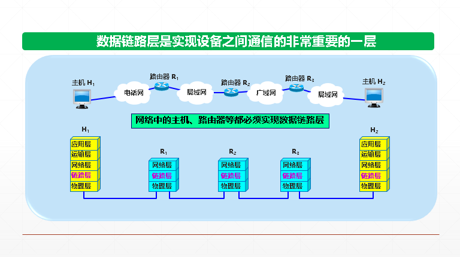

## > 差错检测

- 在传输过程中，可能因为信号放大、噪声等问题，导致比特差错。
- 在一段时间内，传输错误的比特占所传输比特总数的比率称为误码率 BER (Bit Error Rate)。
- 在数据链路层传送的帧中，广泛使用了循环冗余检验 CRC 的检错技术。
   - 循环冗余检验的原理：  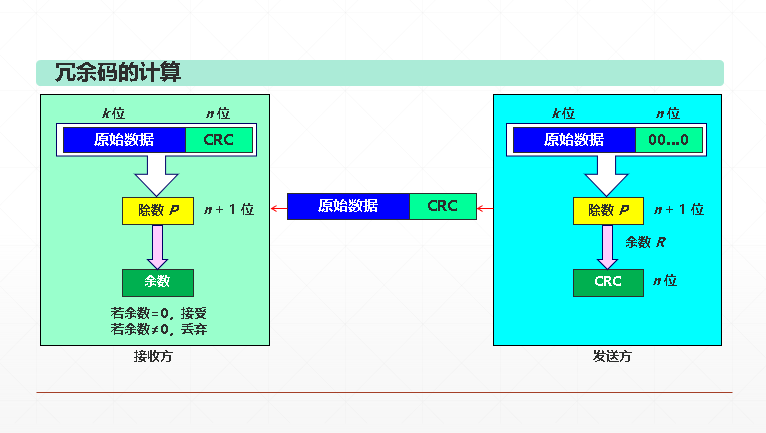
   - 例：生成多项式𝐺(𝑥)=𝑥^4+𝑥^3+1，意味着除数是11001。（按照国际通行标准选择，最高位和最低为必须为1。）
   - 帧检验序列 FCS – Frame Check Sequence - 这里的冗余码就称为FCS。
   - CRC可以做到“无差错接受”：凡是接受的帧（即不包括丢弃的帧），我们都能以非常接近于 1 的概率认为这些帧在传输过程中没有产生差错”。也就是说：“凡是接收端数据链路层接受的帧都没有传输差错”（有差错的帧就丢弃而不接受）。**或称之为“无比特差错”**
   - 但是，并不能做到可靠传输 – （发送什么就收到什么），必须加上确认和重传机制（其他层协议负责）

## > 广播信道、信道复用

- 链路层有两种不同的“链路”形式：
   - 点对点（point-to-point）形式 - 采用PPP协议进行通信，专享信道。
   - 广播形式（共享线路或者传输媒介） - 局域网、802.11 无线局域网

## > 多接入协议
广播信道中，往往只有1条共享的广播信道 (single shared broadcast channel)却有两个或多个节点，可能发生同时的数据传输。这会导致干涉的发生（或“碰撞collision”）：如果一个node同时需要发送两个信号，或者多个node需要同时发送多个信号。
- 分布式算法 – 每个节点上分别决定是否应该发送信号
- “how nodes share channel”“何时可以发送信号”
- 注意，所有的协议通信用到的也是该广播信道自身！即，**没有额外的信道用于协调这些节点。**

三类多接入协议： 
- 信道划分 （channel partitioning） 
　　将信道分为小块（例如分成time slots、根据频率划分、采用不同的编码调制信号等）
每一小块被一个节点独享 
   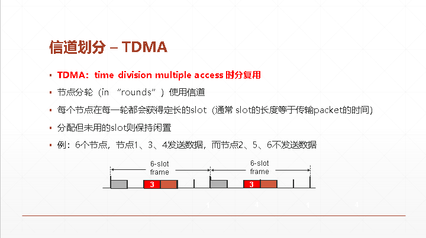 
   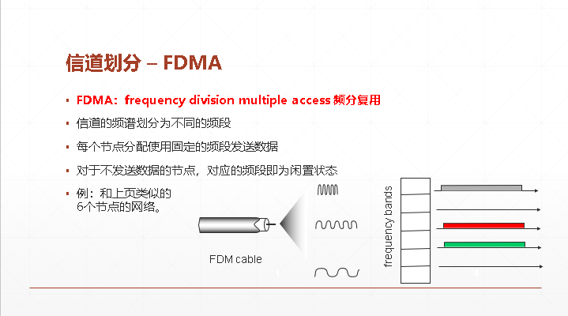 
   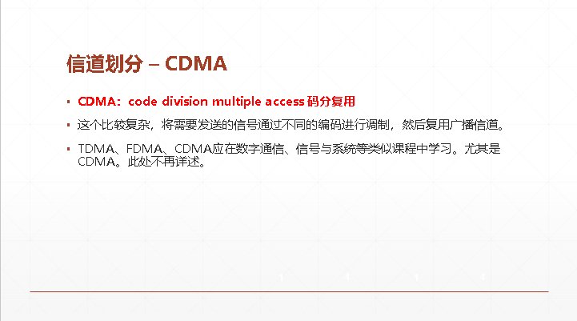 
- 随机接入 （random access） 
　　不划分信道，允许碰撞，尝试从“碰撞”中“恢复”  
   - 随机：当一个节点有数据需要发送时,以信道带宽R全速发送；且不需要经过节点之间的事先协调。
   - 碰撞：当多个节点同时发送数据，则会导致碰撞
   - 典型的随机接入信道复用协议：
      - Slotted ALOHA; ALOHA 
      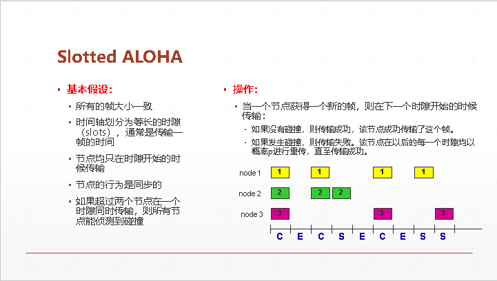 
      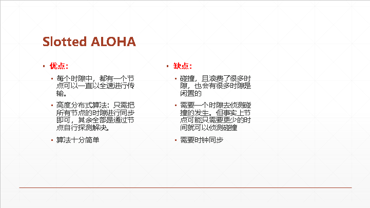 
      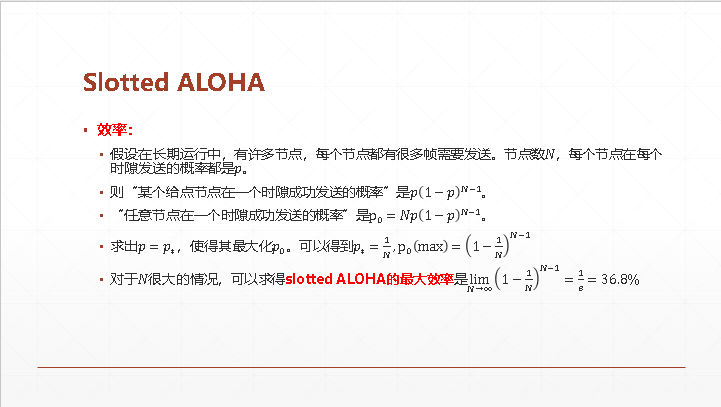 
      - CSMA, CSMA/CD, CSMA/CA 
      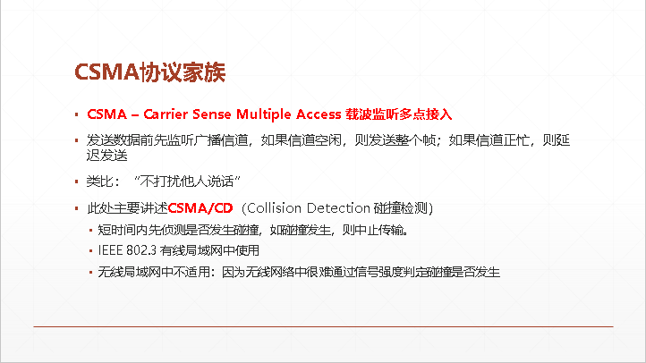 
- 受控接入（’taking turns’） 
　　节点轮流发送信息  
   - 轮询 polling：主节点（master）邀请次节点（slave nodes）轮流发送数据。
      - 存在的问题：轮询的开销、延迟、单点故障（即master节点）
   - 令牌传递 token passing：受控的令牌从一个节点依次序传递到下一个节点有令牌的节点即可发送帧.
      - 存在问题：传递令牌的开销、延迟、单点故障（令牌本身）

## > 链路层寻址

**Media Access Control – MAC地址（也称为局域网地址、硬件地址、物理地址、以太网地址等）**
- 一个地址块可以生成 224 个不同的地址。这种 48 位地址称为 MAC-48，它的通用名称是 EUI-48。
生产适配器时，6 字节的 MAC 地址已被固化在适配器的 ROM，因此，MAC 地址也叫做硬件地址 (hardware address) 或物理地址。
- NIC检查MAC地址
  - 适配器从网络上每收到一个 MAC 帧就首先用硬件检查 MAC 帧中的 MAC 地址。如果是发往本站的帧则收下，然后再进行其他的处理。否则就将此帧丢弃，不再进行其他的处理。发往本站的帧”包括以下三种帧： 
     - 单播 (unicast) 帧（一对一）
     - 广播 (broadcast) 帧（一对全体）
     - 多播 (multicast) 帧（一对多）
  - 所有的适配器都至少能够识别前两种帧，即能够识别单播地址和广播地址。
  - 有的适配器可用编程方法识别多播地址。
  - 只有目的地址才能使用广播地址和多播地址。
  - 以混杂方式 (promiscuous mode) 工作的以太网适配器只要“听到”有帧在以太网上传输就都接收下来。
  
### ARP协议

已知一个端口的IP地址，如何获知它的MAC地址？

- ARP表：局域网中的每个节点（主机、路由器等）都有一张表，称之为ARP表。其中存储了局域网中某些节点的IP地址/MAC地址的映射关系。<IP address; MAC address; TTL>TTL (time to live): 多久之后忘记该映射（典型值：20分钟）。

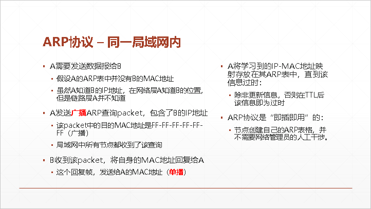 
- ARP协议 – 不在同一局域网内：过程基本相同，但需要分开先从边缘路由器跳转，获得各自的MAC地址。

### 以太网

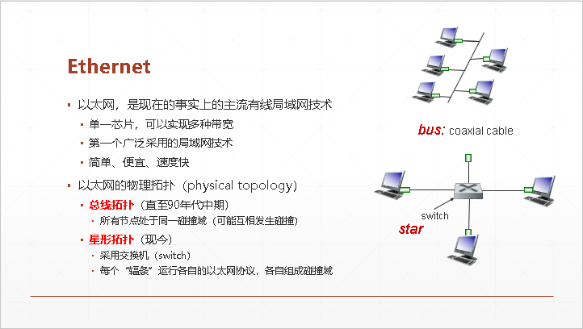 
- 以太网的帧结构： 
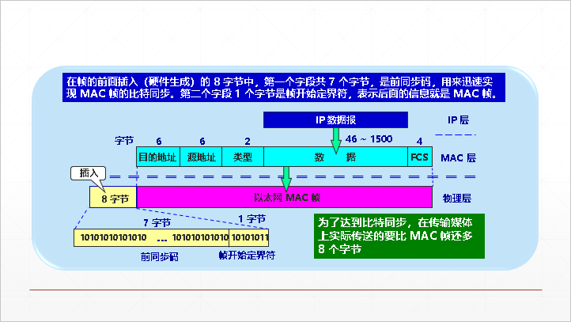
- 什么是无效的帧？
   - 帧长度不是整数字节
   - CRC校验失败
   - 数据字段的长度不在46~1500字节之间
   - MAC帧长度不在64~1518字节之间
- 不可靠、无连接的以太网：
   - 无连接 connectionless：发送的NIC和接收的NIC并不需要用握手来建立连接。
   - 不可靠：接收的NIC不需要向发送的NIC发送ACK或者NACK等packet来表达“是否收到帧” （若帧被丢弃，则只能通过上层协议来恢复（例如，提供了可靠数据传输的协议，如TCP，之后会学到）；如没有通过上层协议恢复，则数据就丢失了）
   - Ethernet中用到的信道复用协议是unslotted CSMA/CD with binary backoff。

### 交换机

- 为什么要使用交换机？
   - 在链路层扩展以太网，常用的方法是使用以太网交换机-扩大以太网规模，将不同的网络连接在一起。
   - 交换机是链路层设备，通常也称为“第二层交换机”（L2 switch），强调这种交换机工作在链路层：存储并转发以太网帧、检查收到的帧的MAC地址，选择性地转发该帧到一个或多个链路。
   - 交换机是透明的：主机并不知道交换机的存在；
   - 即插即用、自学习：交换机不需要手动配置，它自动学习网络拓扑;
   - 相互通信的主机都是独占传输媒体，无碰撞地传输数据。
- 交换机的特点:
   - 通常都有十几个或更多的接口。每个接口都直接与一个单台主机或另一个交换机相连，并且一般都工作在全双工方式。
   - 交换机具有并行性。能同时连通多对接口，使多对主机能同时通信。
   - 交换机的接口有存储器，能在输出端口繁忙时把到来的帧进行缓存。
   - 交换机使用了专用的交换结构芯片，用硬件转发，其转发速率非常高。
   - 交换机的性能远远超过普通的集线器，而且价格并不贵。
   - 用户独享带宽，增加了总容量： 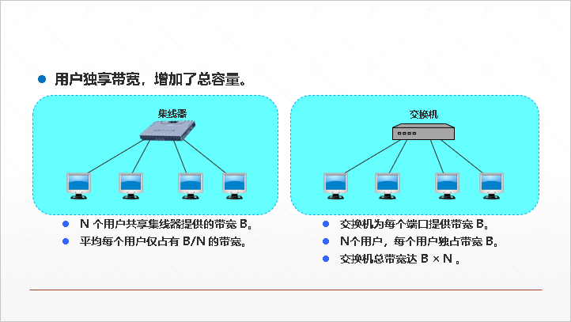 
- 交换表/转发表 forwarding table - 如何知道“主机通过哪个接口可以访问？”
   - ’A’可以通过接口4访问；’B’可以通过接口5访问······
   - 每个交换机有一个交换表，表的内容是（**主机的MAC地址，通过哪个接口访问，有效时间**）
- 交换机功能：过滤帧、转发帧
   - 当交换机收到一个帧
   1. 记录进入交换机的链路，以及发送主机的MAC地址 
   2. 根据目的地MAC地址，从交换表里面寻找对应条目 
   　2.1 如果找到了对应条目 
   　　2.1.1 如果目的地和帧的来源一样，则丢弃该帧 
   　　2.1.2 否则，根据找到的对应条目，从正确的接口将帧转发出去 
   　2.2 如果没有找到对应条目 
   　　2.2.1 则泛洪该帧（通过除了进来的接口以外的其他所有接口转发该帧） 
   - 交换机的自学习功能: 
   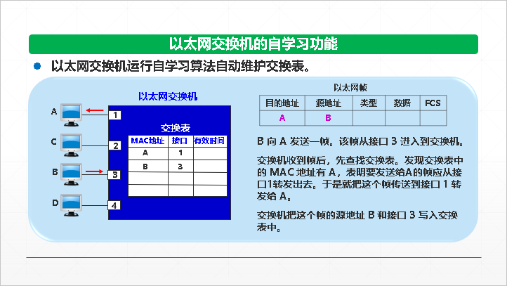
      - 考虑到可能有时要在交换机的接口更换主机，或者主机要更换其网络适配器，这就需要更改交换表中的项目。 为此，在交换表中每个项目都设有一定的有效时间。过期的项目就自动被删除。
- 步骤归纳总结: 
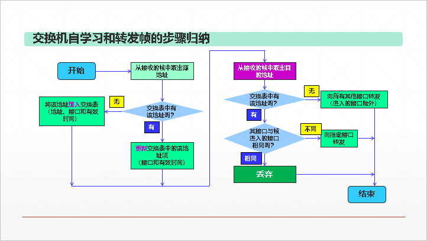

## > 虚拟局域网

- 利用以太网交换机可以很方便地实现虚拟局域网 VLAN (Virtual LAN)。
- IEEE 802.1Q 对虚拟局域网 VLAN 的定义：虚拟局域网 VLAN 是由一些局域网网段构成的与物理位置无关的逻辑组，而这些网段具有某些共同的需求。每一个 VLAN 的帧都有一个明确的标识符，指明发送这个帧的计算机是属于哪一个 VLAN。
- 虚拟局域网其实只是局域网给用户提供的一种服务，而并不是一种新型局域网。由于虚拟局域网是用户和网络资源的逻辑组合，因此可按照需要将有关设备和资源非常方便地重新组合，使用户从不同的服务器或数据库中存取所需的资源。
- 当 B1 向 VLAN2 工作组内成员发送数据时，工作站 B2 和 B3 将会收到其广播的信息。VLAN1 和 VLAN3 中的工作站 A1，A2 和 C1 等都不会收到 B1 发出的广播信息。  
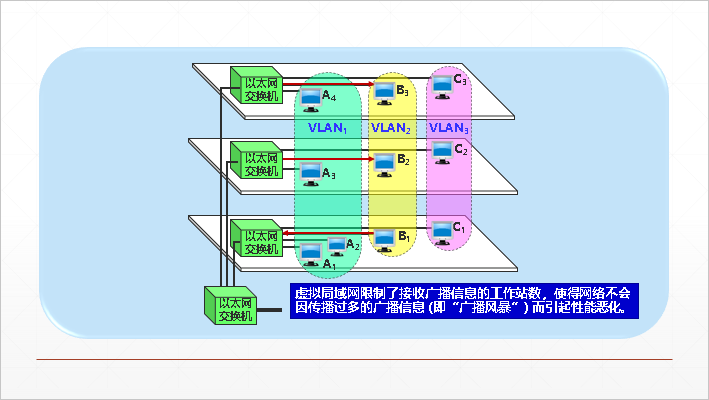
- 虚拟局域网（VLAN）技术具有以下主要优点：
   - 改善了性能
   - 简化了管理
   - 降低了成本
   - 改善了安全性
- 划分虚拟局域网的方法:
   - 基于交换机端口 [详情见PPT]
   - 基于计算机网卡的MAC地址 [详情见PPT]
   - 基于协议类型 [详情见PPT]
   - 基于IP子网地址 [详情见PPT]
   - 基于高层应用或服务 [详情见PPT]
